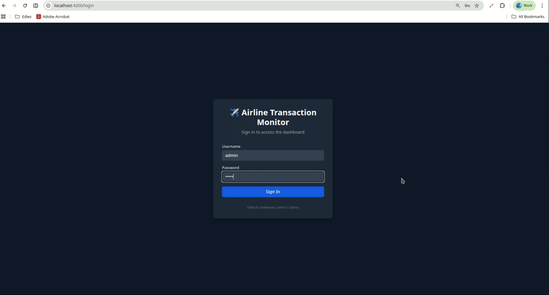
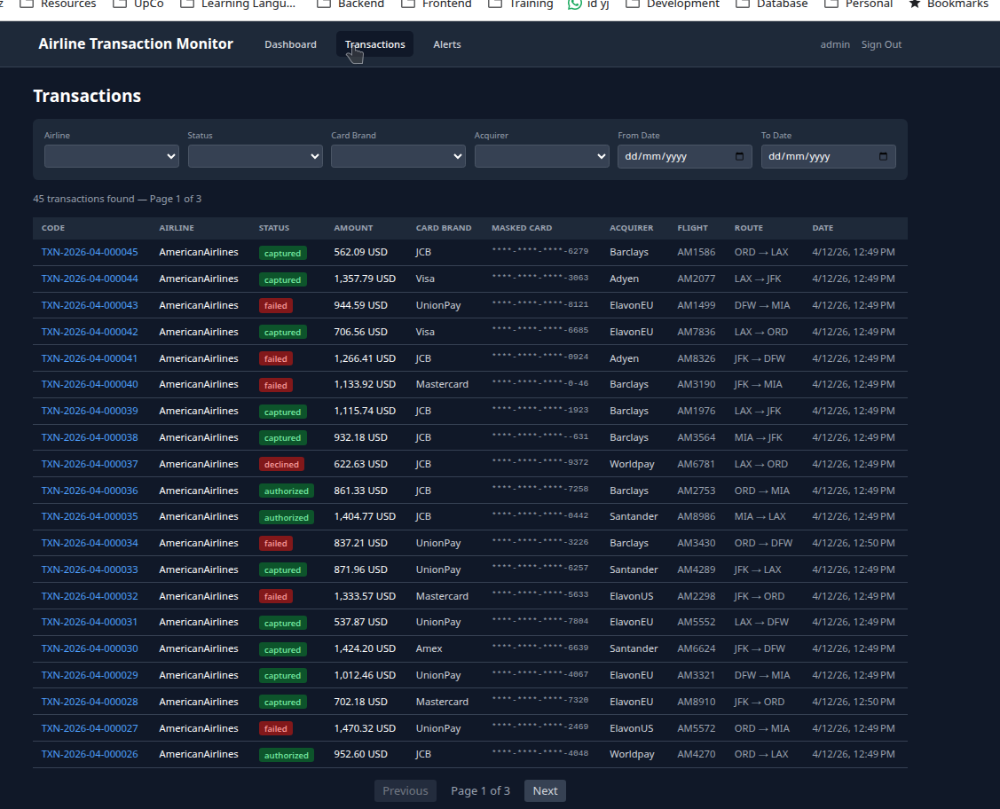
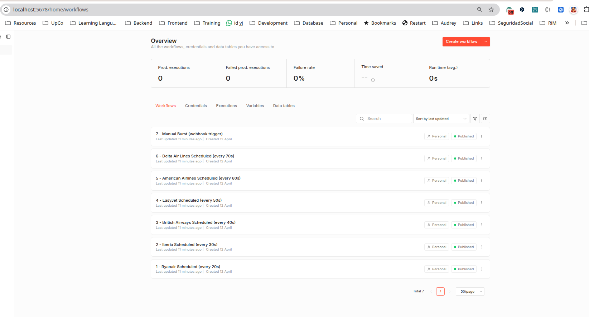
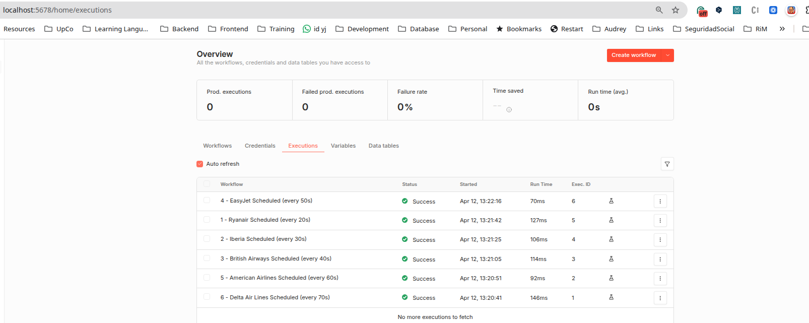
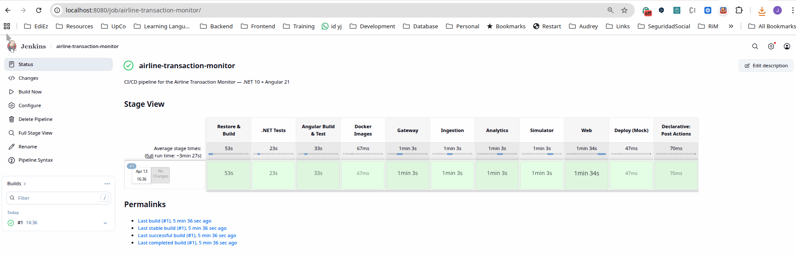
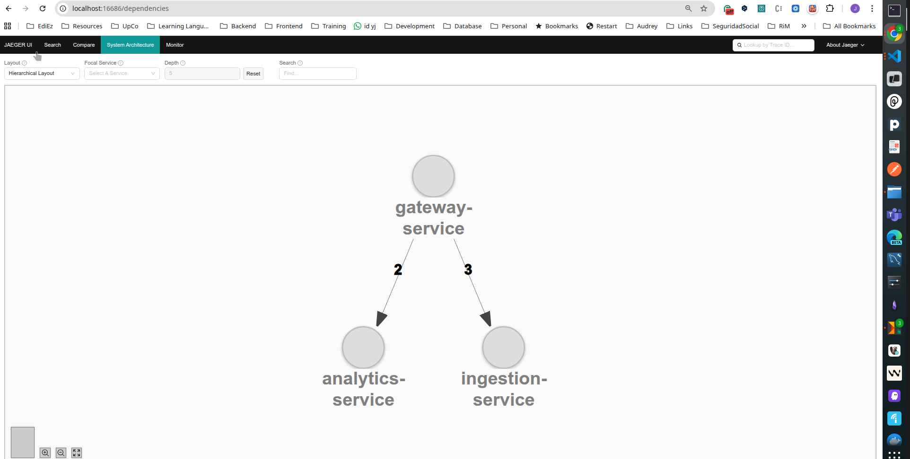
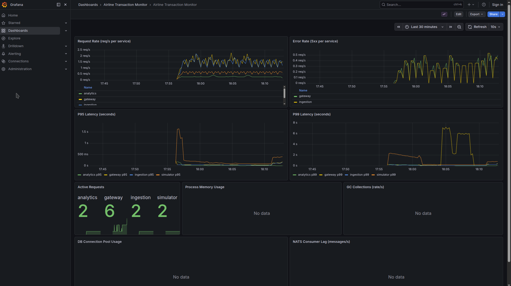
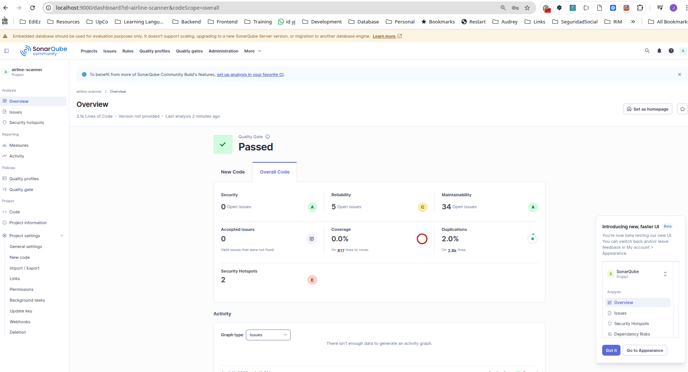

# Airline Transaction Monitor

Distributed real-time payment monitoring system for aviation FinTech. Ingests airline transactions via REST, processes them through an analytics pipeline, raises alerts when error thresholds are crossed, and pushes state to a real-time Angular dashboard via SignalR.

## Demo


*Real-time dashboard: login → live transactions → n8n burst → alert raised*

## Quick Start

```bash
# Start the full stack (12 containers)
docker compose up -d

# Import n8n workflows (one-time, after completing n8n setup wizard at http://localhost:5678)
npm run n8n:import

# Open the dashboard
open http://localhost:4200    # Login: admin / admin
```

Within 20–70 seconds, the n8n workflows will start generating transactions automatically and the dashboard will populate with real-time data.


*Transaction list with filters, pagination, and status badges*

## Architecture

```
                              ┌──────────────────┐
                              │    Angular 21    │
                              │    (Dashboard)   │
                              │  Signals+Zoneless│
                              └────────┬─────────┘
                                       │ HTTP + SignalR
                                       ▼
                          ┌────────────────────────┐
                          │   API Gateway (.NET 10) │
                          │  - JWT auth + routing   │
                          │  - SignalR hub          │
                          │  - NATS subscriber      │
                          └──────────┬─────────────┘
                                     │
                            ┌────────┴────────┐
                            ▼                 ▼
                     ┌──────────┐      ┌──────────────┐
                     │Ingestion │      │  Analytics   │
                     │ Service  │      │   Service    │
                     │ (.NET 10)│      │ (.NET 10)    │
                     └────┬─────┘      └──────┬───────┘
                          │                   │
                          │  NATS JetStream    │
                          └─────────┬─────────┘
                                    │
                           ┌────────┴────────┐
                           │                 │
                      ┌────▼────┐      ┌─────▼─────┐
                      │Postgres │      │ Postgres  │
                      │Ingestion│      │ Analysis  │
                      │   DB    │      │    DB     │
                      └─────────┘      └───────────┘

Demo-only:  n8n (scheduler) → TransactionSimulator (.NET 10 + Bogus) → API Gateway
```

### Why Three Services?

| Service | Responsibility | Scaling Profile |
|---------|---------------|-----------------|
| **API Gateway** | JWT auth, request routing, SignalR real-time hub | Scales with connected dashboard clients |
| **Ingestion Service** | Validate transactions, persist to DB, publish events | Scales with transaction volume |
| **Analytics Service** | Compute rolling metrics, evaluate alert rules | Scales with event processing load |

Services communicate exclusively through **NATS JetStream** — no direct HTTP calls between them. Each can be scaled independently.

## Tech Stack

| Layer | Technology |
|-------|-----------|
| **Backend runtime** | .NET 10 (LTS), C# 14 |
| **Backend services** | 4 × ASP.NET Core Web API (Gateway + Ingestion + Analytics + Simulator) |
| **ORM** | Entity Framework Core (code-first migrations) |
| **Database** | PostgreSQL 16 (two databases: ingestion_db + analytics_db) |
| **Message broker** | NATS JetStream |
| **Real-time push** | SignalR (WebSocket) |
| **Auth** | JWT bearer tokens |
| **Frontend** | Angular 21 (Signals + Zoneless change detection) |
| **Frontend styling** | Tailwind CSS v4 |
| **Demo data** | Bogus (realistic transaction generation) |
| **Demo scheduling** | n8n (7 pre-loaded workflows) |
| **Observability** | OpenTelemetry → Jaeger (traces) + Prometheus (metrics) + Grafana (dashboards) |
| **Code quality** | SonarQube (quality gates) |
| **CI/CD** | Jenkins (Declarative Jenkinsfile, custom Docker image with .NET + Node.js) |
| **Health checks** | ASP.NET Core HealthChecks on `/health` (all 4 services) |
| **API documentation** | OpenAPI / Swagger on `/openapi/v1.json` (all 4 services, dev mode) |
| **Testing (.NET)** | xUnit + Moq + EF Core InMemory (43 tests) |
| **Testing (Angular)** | Vitest via Angular 21 built-in runner (14 tests) |
| **Infrastructure** | Docker Compose (12 containers + Jenkins via profile) |

## Service Ports

| Service | Port | URL |
|---------|------|-----|
| Angular Dashboard | 4200 | http://localhost:4200 |
| API Gateway | 5000 | http://localhost:5000 |
| Ingestion Service | 5001 | http://localhost:5001 |
| Analytics Service | 5002 | http://localhost:5002 |
| TransactionSimulator | 5003 | http://localhost:5003 |
| PostgreSQL | 5432 | localhost:5432 |
| NATS | 4222 | localhost:4222 |
| NATS Monitor | 8222 | http://localhost:8222 |
| n8n | 5678 | http://localhost:5678 |
| Jaeger UI | 16686 | http://localhost:16686 |
| Prometheus | 9090 | http://localhost:9090 |
| Grafana | 3000 | http://localhost:3000 |
| SonarQube | 9000 | http://localhost:9000 |
| Jenkins | 8080 | http://localhost:8080 (via `npm run jenkins:up`) |

## How to Authenticate and Try the API

### Login

```bash
curl -X POST http://localhost:5000/api/auth/login \
  -H "Content-Type: application/json" \
  -d '{"username":"admin","password":"admin"}'
```

Returns: `{ "token": "eyJ...", "username": "admin", "expiresAt": "..." }`

Default users: `admin/admin`, `operator/operator`, `viewer/viewer`, `simulator/simulator`

### Create a Transaction

```bash
TOKEN=<paste token from login>

curl -X POST http://localhost:5000/api/transactions \
  -H "Content-Type: application/json" \
  -H "Authorization: Bearer $TOKEN" \
  -d '{
    "airlineCode": "Ryanair",
    "maskedCard": "****-****-****-1234",
    "cardBrandCode": "Visa",
    "amount": 4599,
    "currencyCode": "EUR",
    "acquirerCode": "Adyen",
    "status": "captured",
    "flightNumber": "FR1234",
    "originAirport": "DUB",
    "destinationAirport": "STN",
    "passengerReference": "PNR-ABC123"
  }'
```

### Generate Demo Transactions via Simulator

```bash
curl -X POST http://localhost:5003/api/simulator/generate \
  -H "Content-Type: application/json" \
  -d '{"airlineCode":"Ryanair","count":10,"errorRate":0.1}'
```

### Trigger a Burst (High Error Rate Alert)

```bash
curl -X POST http://localhost:5003/api/simulator/burst \
  -H "Content-Type: application/json" \
  -d '{"airlineCode":"AmericanAirlines","count":50,"errorRate":0.4}'
```

## n8n Workflows (Demo-Only)

7 pre-loaded workflows that automatically generate transactions:

| # | Workflow | Trigger | Airline | Count | Error Rate |
|---|---------|---------|---------|-------|------------|
| 1 | Ryanair | Every 20s | Ryanair | 5 | 2% |
| 2 | Iberia | Every 30s | Iberia | 3 | 3% |
| 3 | British Airways | Every 40s | BritishAirways | 3 | 4% |
| 4 | EasyJet | Every 50s | EasyJet | 2 | 5% |
| 5 | American Airlines | Every 60s | AmericanAirlines | 2 | 6% |
| 6 | Delta Air Lines | Every 70s | DeltaAirLines | 2 | 7% |
| 7 | Manual Burst | Webhook | Configurable | 50 | 40% |

Airlines 5 and 6 have error rates above the alert thresholds, so alerts fire automatically.

The n8n workflows serve as the **seed mechanism** — no separate seed endpoint is needed. Within 20–70 seconds of activation, the dashboard is fully populated with realistic transaction data and live alerts.


*7 pre-loaded workflows — 6 scheduled + 1 manual burst*


*All workflows executing successfully with sub-150ms run times*

**First-time setup:** Complete the n8n setup wizard at http://localhost:5678/setup, then import workflows:

```bash
npm run n8n:import
```

Activate each workflow in the n8n UI to start the automated demo traffic.

## Jenkins CI/CD Pipeline

The project includes a working Jenkins instance with a custom Docker image containing .NET SDK, Node.js, and Docker CLI.

```bash
# Build and start Jenkins
npm run jenkins:build
npm run jenkins:up

# Open Jenkins UI — login: admin / admin
open http://localhost:8080

# Click "Build Now" on the airline-transaction-monitor pipeline
# All stages execute: Restore → Build → .NET Tests → Angular Tests → Docker Images → Deploy
```

Pipeline stages: Restore & Build (53s) → .NET Tests (23s) → Angular Build & Test (33s) → Docker Images (5 parallel, ~1min each) → Deploy Mock


*Stage View — all pipeline stages green*

```bash
# Other Jenkins commands
npm run jenkins:logs    # Follow logs
npm run jenkins:ps      # Check status
npm run jenkins:down    # Stop Jenkins only
npm run jenkins:clean   # Stop + remove volume
```

## npm Scripts

| Command | Description |
|---------|------------|
| `npm run dc:up` | Start full stack (12 containers) |
| `npm run dc:down` | Stop full stack |
| `npm run dc:clean` | Stop + remove volumes |
| `npm run dc:ps` | Show container status |
| `npm run dc:logs` | Follow all logs |
| `npm run infra:up` | Start infra only (7 containers) |
| `npm run infra:down` | Stop infra |
| `npm run gateway` | Run Gateway locally |
| `npm run ingestion` | Run Ingestion locally |
| `npm run analytics` | Run Analytics locally |
| `npm run simulator` | Run Simulator locally |
| `npm run web` | Run Angular dev server |
| `npm run build` | Build .NET solution |
| `npm run test` | Run .NET tests (43 xUnit) |
| `npm run web:test` | Run Angular tests (14 Vitest) |
| `npm run web:build` | Build Angular for production |
| `npm run n8n:import` | Import n8n workflows |
| `npm run jenkins:up` | Start Jenkins (CI profile) |
| `npm run jenkins:down` | Stop Jenkins only |

## Observability

### Jaeger (Distributed Tracing)

Open http://localhost:16686. Select a service (gateway-service, ingestion-service, analytics-service) and click "Find Traces". Each transaction produces connected traces across all services.


*Service dependency graph — Gateway → Ingestion + Analytics with connected traces*

### Grafana (Metrics Dashboards)

Open http://localhost:3000 (no login required). Navigate to Dashboards → Airline Transaction Monitor. Panels: Request Rate, Error Rate, P95/P99 Latency, Active Requests, DB Connection Pool Usage, NATS Consumer Lag, Process Memory Usage, GC Collections.


*9-panel dashboard with request rates, latency percentiles, and infrastructure metrics*

### Prometheus

Open http://localhost:9090. Targets page shows all 4 .NET services scraped every 15s.

### SonarQube

Open http://localhost:9000. Login: admin (password set during first run). The project shows code quality metrics: 0 security issues, 2% duplication, quality gate passed.


*Quality gate passed — 0 bugs, 0 vulnerabilities, 2.0% duplication*

### Health Checks

All 4 .NET services expose `/health` endpoints with checks for PostgreSQL connectivity (Ingestion + Analytics) and NATS connection status (Gateway + Ingestion + Analytics):

```bash
curl http://localhost:5000/health   # Gateway
curl http://localhost:5001/health   # Ingestion
curl http://localhost:5002/health   # Analytics
curl http://localhost:5003/health   # Simulator
```

### API Documentation (Swagger / OpenAPI)

All services expose OpenAPI specs in development mode at `/openapi/v1.json`. When running locally with `dotnet run`, Swagger UI is available for API exploration.

## Testing

### .NET Tests (43 tests)

```bash
dotnet test    # or: npm run test
```

- **Unit tests**: TransactionRepository, MetricsService, TokenService, UserStore (Moq + EF Core InMemory)
- **Integration tests**: WebApplicationFactory with mocked NATS (auth endpoints, health checks)

### Angular Tests (14 tests)

```bash
npm run web:test
```

- AuthService, SignalRService, LoginComponent (Vitest via Angular 21 built-in runner)

## Trade-offs

| Decision | Reasoning |
|----------|----------|
| **NATS JetStream over Kafka** | Lightweight single binary, Docker Compose viable. Same patterns (pub/sub, durable streams). Code abstracts the broker behind a port — swapping to Kafka is a single adapter change. |
| **3 microservices over monolith** | Ingestion, Analytics, and Gateway have distinct scaling profiles. Trade-off: more operational complexity for a small team. |
| **JWT simple over Keycloak/IdentityServer** | Assessment scope. Production: replace with a managed IdP (Auth0, Keycloak). |
| **SonarQube in Compose** | ~1.5GB RAM. Valid for assessment. Production: SonarCloud or dedicated instance. |
| **Jenkins with custom Docker image** | Demonstrates working CI/CD pipeline. Production: use managed CI (GitHub Actions, GitLab CI). |
| **TransactionSimulator + n8n (demo-only)** | In production, airlines push directly to the Gateway. Simulator + n8n exist only for the reviewer to see a populated dashboard on first run. |
| **Bogus for synthetic data** | Realistic data (valid PANs, sensible amounts, weighted distributions) with minimal code. |
| **Two PostgreSQL databases over one** | Separate Ingestion and Analysis concerns. Same instance for simplicity, different databases. |
| **Angular 21 Signals + Zoneless over NgRx** | Signals are sufficient for component-level reactivity. No Zone.js overhead. NgRx is overkill for this scope. |
| **OpenTelemetry over custom logging** | Industry standard. Vendor-neutral — traces go to Jaeger today, Datadog tomorrow. |

## Assumptions

- All services run on a single machine via Docker Compose (no Kubernetes)
- PostgreSQL instance is shared between Ingestion and Analytics databases (production: separate instances)
- JWT secret is hardcoded in appsettings.json (production: use a secret manager like HashiCorp Vault)
- n8n requires a one-time manual setup wizard (cannot be bypassed via environment variables)
- SonarQube requires manual first-login password change
- Alert thresholds are hardcoded in MetricsService (production: configurable via API or config file)
- Rolling metric windows are cumulative counters, not true time-windowed aggregations (production: use Redis or time-series DB)
- Integration tests use EF Core InMemory + mocked NATS instead of Testcontainers — chosen for faster CI execution and zero Docker dependency in the test pipeline; production would use Testcontainers with real Postgres + NATS
- The TransactionSimulator can be disabled by setting `SIMULATOR_ENABLED=false` in docker-compose.yml (defaults to `true`)

## Decisions Postponed

- **Kubernetes manifests / Helm charts** — out of scope, mentioned as production extension
- **PCI-DSS compliance** — masked PAN is sufficient for the assessment
- **Multi-tenant authentication** — single user store is acceptable
- **Alert delivery channels** (email, Slack, PagerDuty) — alerts only appear in dashboard + database
- **Historical analytics** beyond rolling windows — long-term aggregation out of scope
- **Distributed transactions / sagas** — eventual consistency is acceptable
- **Rate limiting and throttling** — not implemented for the assessment
- **Database connection pooling configuration** — using EF Core defaults

## What I Would Do Differently

1. **Use Redis for rolling metrics** — current implementation uses PostgreSQL which doesn't handle time-windowed aggregations efficiently at scale
2. **Add YARP or Envoy** for API Gateway — current proxy implementation is manual HttpClient forwarding
3. **Use Keycloak or Auth0** for identity — proper OIDC flows, refresh tokens, role-based access
4. **Add Kubernetes manifests** — Helm charts with horizontal pod autoscalers per service
5. **Implement circuit breakers** (Polly) on inter-service HTTP calls
6. **Add structured logging** with Serilog → Elasticsearch → Kibana
7. **Use time-series database** (InfluxDB or TimescaleDB) for metrics instead of PostgreSQL
8. **Add API versioning** and rate limiting
9. **Implement proper error rate windowing** with sliding windows instead of cumulative counters
10. **Add end-to-end tests** using Playwright for the Angular dashboard

## How to Extend for Production

1. **Container orchestration**: Deploy to Kubernetes with Helm charts, HPA for each service
2. **Message broker**: Swap NATS adapter for Kafka adapter (hexagonal architecture makes this a single file change)
3. **Identity**: Replace JWT SimpleAuth with Keycloak/Auth0 OIDC
4. **Secrets**: Move JWT secret, DB passwords to HashiCorp Vault or AWS Secrets Manager
5. **Monitoring**: Replace Jaeger with Datadog/New Relic, add PagerDuty alerting
6. **Database**: Separate PostgreSQL instances per service, add read replicas
7. **CI/CD**: Replace Jenkins with GitHub Actions, add staging environment, canary deployments
8. **CDN**: Put Angular dashboard behind CloudFront/Cloudflare
9. **API Gateway**: Replace manual proxy with YARP, Kong, or AWS API Gateway

## AI Tools Used

This project was developed with AI assistance from **Claude Code** (Anthropic Claude Opus 4.6 with 1M context). AI was used for:

- **Code generation**: Initial scaffolding of .NET services, Angular components, Docker configurations
- **Architecture guidance**: Hexagonal architecture patterns, NATS JetStream configuration, SignalR integration
- **Debugging**: Resolving NATS serialization issues, EF Core migration conflicts, Docker networking
- **Documentation**: README sections, CLAUDE.md conventions, plan document updates

All generated code was reviewed, tested, and verified by the developer. The full conversation history demonstrates the iterative development process.

---

*Built as a portfolio assessment demonstrating end-to-end distributed system ownership: domain modelling, service decomposition, asynchronous messaging, observability, CI/CD, and modern frontend.*
